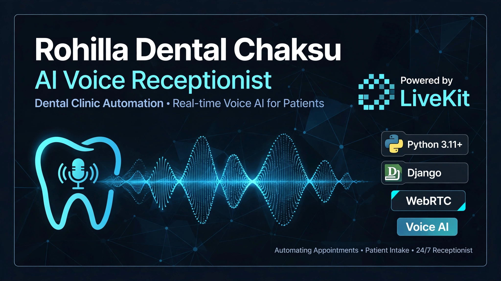

# 🦷 Rohilla Dental Chaksu - AI Voice Receptionist

> **24/7 AI-powered voice receptionist for Rohilla Dental Clinic, Chaksu. Handles patient calls, books appointments, and answers queries automatically using LiveKit Realtime Voice AI.**

### 📖 About The Project
Rohilla Dental Chaksu is a real-world automation for a local dental clinic. Instead of a human receptionist, an AI agent picks up the call, understands the patient's problem in Hindi/English, checks doctor availability, and books the appointment in the system. No missed calls, no waiting.

### ✨ Key Features
- **🎙️ Realtime Voice Conversation:** Ultra low-latency voice-to-voice using LiveKit Agents.
- **📅 Smart Appointment Booking:** Automatically checks calendar and books/cancels appointments via Django API.
- **🧠 Business-Aware Logic:** All clinic info, services, pricing, and doctor timings are stored in `config/businesses/` - agent never hallucinates.
- **🌐 Bilingual Support:** Understands both Hindi and English (Hinglish).
- **📞 Call Handling:** Handles FAQs like clinic location, RCT cost, opening hours, etc.

### 🏗️ How It Works (Architecture)
`Patient Call (WebRTC) -> LiveKit Cloud -> Voice Agent (Python) -> STT -> LLM -> TTS -> Django Backend -> Appointment Confirmed`

1.  User joins LiveKit room from website.
2.  Agent `receptionist/agent.py` joins same room.
3.  Audio is streamed, transcribed, and passed to LLM with business context.
4.  LLM decides to answer or call a tool like `book_appointment`.
5.  Django API saves it to DB.

### 🛠️ Tech Stack
- **Voice Stack:** LiveKit Agents, LiveKit Plugins (STT, LLM, TTS), WebRTC
- **Backend:** Python 3.11+, Django
- **Config:** YAML based business config for easy customization

### 📁 Folder Structure
- `/receptionist` - Main AI agent logic
- `/config/businesses` - All clinic data (services, timings, etc.)
- `pyproject.toml` - Dependencies

### 🚀 Quick Start
1.  Clone the repo
2.  `pip install -e .`
3.  Setup `.env` with LiveKit keys (LIVEKIT_URL, API_KEY, API_SECRET)
4.  `python receptionist/agent.py dev`

### 🔮 Future Scope
- WhatsApp integration
- Payment reminder calls
- Post-treatment follow-up calls

---
**Made with ❤️ by Naman Rohilla | For Rohilla Dental Clinic, Chaksu**
